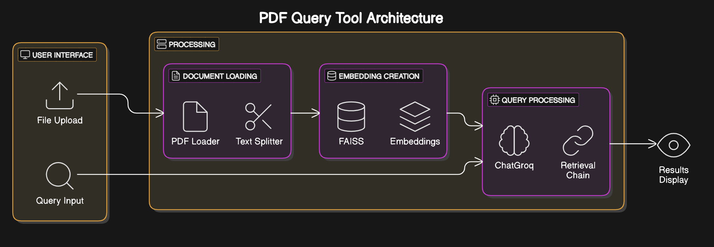

# DocuSift: Smart PDF Query Tool

## Overview
DocuSift is a smart PDF query tool that allows users to upload PDF files and query them using natural language. The tool processes the PDF documents, creates embeddings, and retrieves relevant information based on user queries.

## Architecture


The image above shows the architecture of the PDF Query Tool. It consists of the following components:

1. **User Interface**: Allows users to upload PDF files and input queries.
2. **Processing**: 
   - **Document Loading**: Loads and splits the PDF documents.
   - **Embedding Creation**: Creates embeddings using FAISS and stores them.
   - **Query Processing**: Processes user queries using ChatGroq and retrieves relevant information.
3. **Results Display**: Displays the results of the query to the user.

## Requirements
- Python 3.8+
- Streamlit
- LangChain
- FAISS
- PyPDF2
- dotenv

## Installation
1. Clone the repository:
   ```bash
   git clone https://github.com/yourusername/DocuSift.git
   
